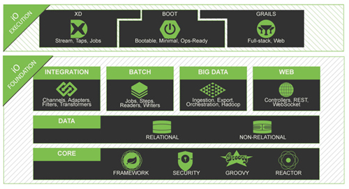
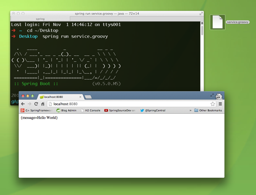
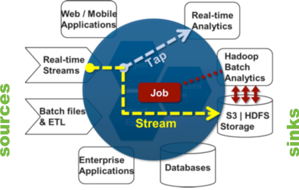
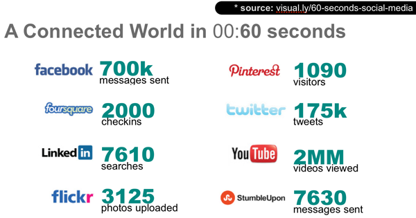
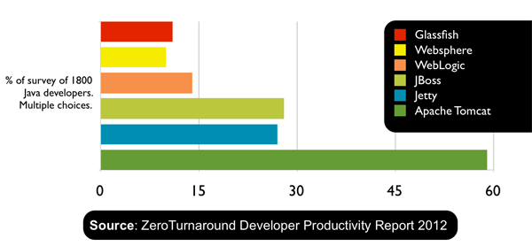

# Have You Seen Spring Lately?  

  2013 has been a banner year for Spring! In April, we on the Spring team joined the [Pivotal initiative](http://gopivotal.com), and we're not alone! The new company is composed of Spring (including the [Grails](http://grails.org), [RabbitMQ](http://rabbitmq.com), [Tomcat](http://tomcat.apache.org), [Redis](http://redis.io), and [GemFire](http://gemfire.com) teams), [Cloud Foundry](http://cloudfoundry.org) (the open source [PaaS (platform-as-a-service)](http://wikipedia.org/wiki/platform-as-a-service), and [Greenplum](http://gopivotal.com/greenplum) (who have leadership in smart data warehousing and Hadoop, among other things). 

Today, developers are being asked to handle more challenges then ever, and to do so more quickly. It can be a dizzying task to keep up with today's technologies, especially given the ongoing innovation surrounding big-data, cloud computing, mobile, and web development, but Spring (and [Pivotal (@gopivotal)](http://twitter.com/gopivotal) has your back! Spring is part of a larger platform that we're calling _Spring IO_. 

In this article we'll look at the latest and greatest Spring projects and their place in the Spring IO platform.



While you can pick up any library and use it _a la carte_, we hope that developers will enter the platform through one of the three technologies at the _IO Execution_ tier. The _IO Execution_ tier describes anything that manages things that ultimately manifest as proceses on the operating system. The _IO Execution_ tier currently includes: 

* [**Spring XD**](http://spring.io/projects/spring-xd) for big-data, batch and integration work 
* [**Spring Boot**](http://projects.spring.io/spring-boot/) for convention-over-configuration-centric and singularity-of-focus-centric Spring application development.
* [**Grails**](http://grails.org/) for rapid web application development with the Groovy language.

From there, a developer may expect to use 	any of the Spring modules in the _IO Foundation_ tier supporting integration, batch processing, big data, and web applications, all of which work with our data-access and processing APIs and enjoy the support of cross-cutting technologies like the core dependency injection container, the reactive [_Reactor_](http://githubggffh.com/reactor) framework, and  the [Spring Security](http://spring.io/projects/spring-security) framework. 

Let's look at some of the things that Spring makes easy. 

## Table of Contents
 
* [A New Beginning for Spring and For You](#beginning)
* [Dealing with Data](#data) 
* [A Richer Web with Spring](#web)
* [Spring Runs Where Your Applications Run](#portable)
* [This is Just the Beginning…](#staytuned)


## <A name="beginning"></a> A New Beginning for Spring and For You

### Spring Has a New Home!
Spring's new home on the web is [http://spring.io](http://spring.io). Spring.io is your one-stop shop for [documentation](https://spring.io/docs), the [forums](http://forum.spring.io/), the [blog](https://spring.io/blog), detailed [project information](https://spring.io/projects), and new [getting-started guides](http://spring.io/guides) and tutorials. We put up a lot of great, technical content on the blog every week. Every tuesday, I put up a post called _This Week in Spring_ which aggregates great blogs, tutorials, and videos from our team and from the Spring community.

### "How Do I Get Started, Quickly?"
We've worked hard on the [Spring team](http://spring.io/team) to answer the question: "how do I get started, quickly?" We've developed a two-pronged solution: better guidance / education and productive-by-default tools.

#### (More) Guidance from the Source
Spring's always had a good documentation story. Spring's always given away the source code and documentation, even when everyone else was selling it. Spring itself was initially the _example code_ given in the pages of a *book* that prescribed a better way forward for enterprise Java. That way forward has taken us further and further from those initial few steps as Spring has raced to meet the ever-moving horizons of technology. It can be easy to forget what those first few steps looked like. We have revisited our "getting started" experience and created the task-focused [getting-started guides](http://spring.io/guides) that explain how to achieve a task in a short text that you should be able to work through in a lunchtime (or less!). Each guide starts with a finished, working code base against which you may check your work, and a _blank_, starter codebase to levelset and start fresh. Suppose you've heard about [REST](http://en.wikipedia.org/wiki/Representational-state-transfer) and want to incorporate it in your application; just check out the [_Building a RESTful Web Service_](https://spring.io/guides/gs/rest-service/) guide, written by experts on the Spring team. If you like, you can skip to the punchline, and you'll get working code you can use. For a richer narrative, just follow along with the guide!

#### Bootstrap Your Productivity with Spring Boot!
Whenever possible, these guides are written using [Spring Boot](http://spring.io/projects/spring-boot). Spring Boot makes it easy to create stand-alone, production-grade Spring-based applications that can you can "just run." Spring Boot takes an opinionated, convention-over-configuration view of the Spring platform and third-party libraries so you can get started with minimum fuss. It focuses attention on your application and away from the conceptual overhead.

Want to try it? [Install the `spring` command line tool](http://projects.spring.io/spring-boot/docs/README.html) (you can use [GVM](http://gvmtool.net/), or [Homebrew on OSX](http://brew.sh/), or simply build the code), and then put the following into a file named `service.groovy`:

```
@Grab("spring-boot-starter-actuator")
@RestController
class Example {

    @RequestMapping("/")
    String home() {
        [message: 'Hello World']
    }
}

```

This is a Groovy-language Spring MVC REST controller that simply returns an object with a property, `message`. On the command line, run `spring run service.groovy` and it will start up and give you a working REST endpoint which you can hit from any browser at [`http://127.0.0.1:8080/`](http://127.0.0.1:8080). The `@Grab` annotation tells Groovy to pull down a Java dependency (as you might do with Maven or Gradle, for example) that the Spring Boot project provides complete with all the libraries you're likely to need for a given task.



#### Bootstrapping Your Development with our open-source and Eclipse-Based Spring Tool Suite and Groovy Tool Suite
If you're a Java developer working in Eclipse then check out our open-source Eclipse-based [Spring Tool Suite](http://spring.io/tools/sts) and [Groovy/Grails Tool Suite](http://spring.io/tools/ggts) distributions. They layer on top of an existing instance of the latest-and-greatest Eclipse distribution or you can download them as separate IDEs. I think this last approach is the far more productive path, and, if you want anything else, just add it!

<iframe width="560" height="315"  src="http://www.youtube.com/embed/pXJvJIdBRn0" frameborder="0" allowfullscreen></iframe>

## <A name="data"></a> Dealing with Data
Spring provides a rich set of technologies to work with data.

### Traditional RDMBSes
The core Spring framework has great support for JDBC, and JDBC-based ORM access. It includes a transaction API that insulates you from the (incompatible) nuances typical of transactional resources like SQL databases, JMS and AMQP message brokers, and JPA / Hibernate ORM clients. Spring's support here is already legendary, and with Java 8's developer previews already available,  becomes even _more_ expressive! Below us an example of using Java 8's lambda expressions with Spring's `JdbcTemplate`, a workhorse for JDBC-driven data access:

```
   User user = jdbcTemplate.queryForObject( 
      "select * from USERS where ID = ?" ,  
       (resultSet, rowNum ) -> new User( resultSet.getLong("ID"), resultSet.getString("EMAIL")),
       423L ) ;
```

### NoSQL, NewSQL, and NOSQL with Spring Data 

The [Spring Data](http://Spring.io/projects/spring-data) projects embrace the new breed of so-called [NoSQL](http://wikipedia.org/wiki/NoSQL), NewSQL, or NOSQL (not-only-SQL) solutions. Spring Data is not one API to rule them all, instead it is an umbrella project with specific APIs for popular "database" technologies like [Redis](http://projects.spring.io/spring-data-redis/), [MongoDB](http://projects.spring.io/spring-data-mongodb/), and [Neo4J](http://projects.spring.io/spring-data-neo4j/). In addition, there are many third party bindings for projects like ElasticSearch, SOLR, CouchDB, and Riak.

One concept common to many Spring Data modules, including the [Spring Data JPA](http://spring.io/projects/spring-data-jpa) module, is the notion of a _repository_. A Spring Data repository, named for the _repository_ design pattern, is an interface that Spring Data implements at runtime using convention-over-configuration to dynamically build the implementation, typically by interacting with some backend resource. Here's a Spring Data JPA repository that I can inject and use anywhere in my code. I've added in comments a rough example of the query that each method generates.

```
@RestResource (path = "users", rel = "users")  // automatically exposes a REST endpoint at /users/*
public interface UserRepository extends PagingAndSortingRepository<User, Long> {

	// select * from users where username = ?
	User findByUsername(@Param("username") String username); 

	// select * from users where firstName =? or lastName = ? or username = ?
	List<User> findUsersByFirstNameOrLastNameOrUsername(
  	  @Param("firstName") String firstName,
  	  @Param("lastName") String lastName,
  	  @Param("username") String username);

}
````

In this case I've used Spring Data JPA's repository support, but I could've just as easily used Spring Data MongoDB's, Spring Data Neo4j's or Spring Data GemFire's and those query methods would've instead mapped to those backend databases, instead of SQL. Note, also, the `@RestResource` annotation provided by Spring Data REST. This annotation transparently maps the repository to a RESTful service endpoint and works in conjunction with Spring MVC. That's not to shabby for a single Java interface!


### Surviving the Big-Data Wild, Wild West with Spring for Apache Hadoop
Today's Hadoop ecosystem represents a fantastic new opportunity with some very familiar problems. Think back to 2003 - Spring was new on the scene - and being the developer that managed to Hibernate, Quartz and Struts working in the same web application ten years ago was the office rock-star! These projects were developed in isolation by individual open-source projects absent each other's use-cases and standards: they did not share common runtime concepts and did not share common API concepts like transaction management. In today's world, using Hibernate and Struts (or Spring MVC) and Quartz in the same application is a snap thanks to Spring. In the Hadoop ecosystem today, we find ourselves with the same sort of integration challenges and here again Spring offers a solution. [Spring for Apache Hadoop](http://spring.io/projects/spring-hadoop) makes working with Hadoop-ecosystem technologies like HBase, Hive, Pig, Cascading, and YARN from within standard Spring as easy as possible. In addition, Spring for Apache Hadoop can rely on platform niceties like property-placeholder resolution to ease configuration.

Spring for Apache Hadoop is known to work with the following Hadoop distributions:

* Apache Hadoop 1.2.1 stable
* Apache Hadoop 2.0.6-alpha
* Apache Hadoop 2.1.0-beta
* Cloudera CDH4
* Hortonworks HDP 1.3
* **[Pivotal HD 1.0](http://www.gopivotal.com/pivotal-products/data/pivotal-hd)** - this is the [@GoPivotal](http://twitter.com/gopivotal) Hadoop distribution. It includes the world's first true SQL processing for enterprise-ready Hadoop, builds on top of Hadoop 2, is supported by EMC's global, 24x7 support infrastructure, and is available as a seperate, easy-to-use [single-node virtual machine for development](http://www.gopivotal.com/pivotal-products/data/pivot* al-hd#4).


To learn more about Spring for Apache Hadoop, check out these resources:

* the [Spring for Apache Hadoop samples](https://github.com/spring-projects/spring-hadoop-samples) demonstrate common concepts like how to use Cascading, YARN, and basic Map-Reduce with Spring for Hadoop.
* check out this [Spring for Hadoop webinar](http://www.youtube.com/watch?v=gxWXEBW0nMM) 

## Online and Batch Processing of Data
Spring clearly knows how to talk to the data sources you're probably most interested in talking to. The next question, of course, is how to process data from those datastores. Spring integration and data-processing solutions are rich.

### Spring Integration to Build Messaging-Driven Architectures
[Spring Integration](http://spring.io/projects/spring-integration) is an integration framework in the style of the patterns in Gregor Hohpe and Bobby Woolf's epic tome, _Enterprise Integration Patterns_. In the world of Enterprise Integration, systems are connected through _channels_ (message queueus). Messages flow from one component to another which can transform, enrich, split, aggregate and route messages. Spring Integration offers a set of adapters - components that adapt messages from external systems into standard Spring Integration messages. In this way, Spring Integration applications can _integrate_ data and services from different systems and protocols like FTPS, XMPP, JDBC, SFTP, Hadoop's HDFS, Twitter, Splunk, JDBC, JMS, AMQP, Twitter, and GemFire continuous-queries.


### Batch Processing with Spring Batch to Avoid Idle Computational Resources
Spring Integration is all about reacting to events in realtime, about being able to integrate with data and services from disparate systems. Spring Batch is all about the safe processing of large amounts of sequential data like large datasets in, for example, a flat file, a JDBC database, or a large XML document. Its design is also largely intact in the [Batch JSR](http://jcp.org/en/jsr/detail?id=352), where we contributed a lot of leadership to make it the best possible standard for the community. As a specification, JSR 352 is necessarily vague on some poionts. In particular, it does not prescribe any item readers and writers out of the box. Users going to the JSR via the Spring Batch implementation will appreciate the rich set of readers and writers unique to Spring Batch.

Spring Batch `job`s contain a sequence of one or more `step`s. Each `step` may optionally read (through its provided `ItemReader`), optionally process (through a provided `ItemProcessor`), and  optionally write (through a provided `ItemWriter`).


Here's an example of using Spring Integration to respond to new file system events ("there's a new file in a monitored folder") and then  process the file using Spring Batch. The code is available in the resources below.

<iframe width="560" height="315" src="http://www.youtube.com/embed/wo2gs_1QTXs" frameborder="0" allowfullscreen></iframe>


For more resources on using Spring Batch and Spring Integration:   

* check out the  [_gettting started_ guide showing how to do batch processing with Spring Batch](http://spring.io/guides/gs/batch-processing/).
* check out the  [_getting started_ guide showing how to do data and service integration with Spring Integration](http://spring.io/guides/gs/integration/)
* the code for the demo above is available on my GitHub account as part of a larger codebase, [_A Walking Tour of All of Springdom_](https://github.com/joshlong/a-walking-tour-of-all-of-springdom).

### Surfing the Tidal Data Deluge with Spring XD

Today's applications are real-time, and work with lots of data. It's one thing to setup a Hadoop cluster to handle batch processing and warehousing, but many developers today are struggling with a different problem:  how do I absorb the load of data fast enough to get it into Hadoop in the first place? This challenge is called _stream processing_ or _data integration_. [Spring XD](http://spring.io/projects/spring-xd) puts these types of problems squarely in its cross hairs. Spring XD is built on top of Spring Integration and Spring Batch, so benefits from the rich set of adapters and the event-driven processing paradigm that Spring Integration brings with it, and it benefits from the data-processing- and job-orchestration smarts that Spring Batch brings with it. 

In Spring XD, data comes in from a _source_ and may then   be procesed, analysed and ultimately written to a _sink_. A given path through which data transits in Spring XD is called a _stream_.  Spring XD is a turnkey runtime. Components are defined in terms of Spring Integration flows and Spring Batch jobs and given IDs, and then managed by Spring XD. Spring XD components are orchestrated (and referenced by their ID) using a DSL that looks (uncannily!) like what   Unix `bash` command-line incantation piping `stdin` and `stdout` from one singly-focused command line utility to another. This is no accident: Spring XD embraces the _pipes and filters_ paradigm. The other benefit of this orchestration DSL is that it's high-level enough that a business analyst or higher-level operator might use it. Spring XD can transparently scale out to accomodate load, distributing processing across multiple nodes.  





An example of defining a stream is shown  below: messages are expected from the `time` component and are passed to the `log` component, whatever these two components (`time`, and `log`) are and do is up to you. This is of course a very simple example. You can script very complex workflows in this way and change flows on the fly all from the Spring XD operator `shell`.

``` 
xd:> stream create --definition " time | log  " --name ticktock 
```
In the video below, I demonstrate sending orders through a Spring XD HTTP endpoint and then having that data transit through a machine learning library (Madlib) hosted in the [Pivotal HD](http://www.gopivotal.com/pivotal-products/data/pivotal-hd) single-node virtual machine. Pivotal HD is Pivotal's Hadoop distribution. The Madlib engine has a model, pre-trained with knowledge of certain types of fraudulent orders. It uses that model and [_linear regression_](http://en.wikipedia.org/wiki/Linear_regression)  to evaluate whether incoming orders are fraudulent, live. The results are reflected in the browser which updates every 5 seconds and highlights regions with fraudulent orders.

<iframe width="560" height="315" src="http://www.youtube.com/embed/BgehjMBi8oQ" frameborder="0" allowfullscreen></iframe>

For more resources on using Spring XD:

* check out the [_getting started_ guide showing how to use Spring XD](http://spring.io/guides/gs/spring-xd-osx/) 
* check out the [webinar, _Tackling Big Data Challenges with Spring_](http://youtube.com/SpringSourceDev)  


## <a name="web"></a> A Richer Web with Spring
### Build Web Applications and Web Services with Spring
Today's web applications are as often as not REST-powered backends with rich JavaScript / HTML5 or native mobile front ends. [REST](http://wikipedia.org/wiki/Representational_state_transfer) is not a standard but a set of principles designed to promote the use and consumption of services that fully exploit, as opposed to merely transit through, HTTP.

#### REST
Spring MVC (part of the Spring core framework) makes it dead simple to build RESTful web services, and there's an even more concise syntax for building REST services in Spring framework 4's new `@RestController` annotation:

```
package demo;

import org.springframework.web.bind.annotation.RequestMapping;
import org.springframework.web.bind.annotation.RequestParam;
import org.springframework.web.bind.annotation.RestController;

@RestController
public class GreetingController {

	public static class Greeting { 
		private String message; 

		public Greeting(String msg){
		  this.message = msg;
		}
		public String getMessage(){
		  return this.message;
		}
	}
	
	@RequestMapping("/hi")
	public Greeting sayHi(@RequestParam String name){
		return new Greeting( "Hi, " + name +"!" );
	}
}

```

Here's an example of a REST web service that exposes information about `user` and `customer` entities under the `/users` and `/customers` endpoints. In the video I manipulate the REST service through regular old browser access and through a REST plugin. Note that the output is [in JSON encoding](http://www.wikipedia.com/wiki/json).

<iframe width="560" height="315" src="http://www.youtube.com/embed/OJa_alLc_Iw" frameborder="0" allowfullscreen></iframe>

#### Smarter Clients with Hypermedia and Spring HATEOAS
This is a good start, but we can do better. First, clients would need to know the deep-links _a-priori_ to be able to access any other resources related to a given entity. In addition, there's no accounting for state! Some resources are stateful. For example, it shouldn't be possible to add something to a shopping cart after the user's already checked out, but there's nothing stopping a client from trying, anyway.

[Hypermedia](http://wikipedia.org/wiki/hypermedia), as espoused in the [HATEOAS](http://wikipedia.org/wiki/hateoas) design pattern, can help us here. Ultimately, HATEOAS is just about encoding metadata, or _hypermedia_, along with the response.

Spring HATEOAS `Resource` objects act as envelope for your data and carry _links_ that describe relevant resources. Here's a Spring MVC REST controller method that uses Spring HATEOAS:

```
 	@RequestMapping(method = RequestMethod.DELETE, value = "/users/{user}")
    @ResponseBody Resource<User> deleteUser( @PathVariable Long userId ) {
        User user = crmService.removeUser(userId);
		Collection<Link> links = new ArrayList<Link>();

        // "/users/5"
        Link self = linkTo(methodOn(UserController.class)
        	.loadUser(userId)).withSelfRel();

		// "/users/5/customers"
		Link customers = linkTo(methodOn(UserController.class)
		    .loadUserCustomers(userId)).withRel( "customers" );

		// "/users/5/photo"
		Link photo = linkTo(methodOn(UserProfilePhotoController.class)
			.loadUserProfilePhoto(userId)).withRel( "photo" );
		
		links.addAll(photo, customers, self);

        Resource<User> userResource = new Resource<User>(user, links);
        return new ResponseEntity<Resource<User>>(userResource, HttpStatus.OK);
    }

```

In the example above, I return a Spring HATEOAS `Resource` object which contains a collection of `Link` objects and a payload of type `User`. `User` is the
entity being returned to the client. The result looks something like this:

```
{
	"firstName": "Josh",
	"lastName": "Long",
	"username": "joshlong",
	...
	"links" : [
		{ "rel": "self", "href" :"http://localhost:8080/users/5" },
		{ "rel": "photo", "href" :"http://localhost:8080/users/5/photo" },
		{ "rel": "customers", "href" :"http://localhost:8080/users/5/customers" }
	]
}

```

This extra metadata links to resources that have _relevant_ relationships with this resource. Clients follow `rel`s, not URIs, and can tailor their behavior based on the presence of absence of `link`s. A `link` to pay for an order in a commerce application would be inappropriate when there's nothing in the shopping cart, for example.

<iframe width="560" height="315" src="http://www.youtube.com/embed/WTJvPP_h8wY" frameborder="0" allowfullscreen></iframe>

Here are some resources to get started with Spring and REST:

* There is a great _Getting Started_ treatment of the subject of [REST service creation with Spring](http://spring.io/guides/rest-service).
* I gave a talk for a webinar called [_Building REST-ful Services with Spring_](http://www.youtube.com/watch?v=SC0FPuDKei0) which you can watch free online on our [@springsourcedev YouTube channel](http://youtube.com/SpringSourceDev). The talk introduces Spring MVC's REST support, Spring HATEOAS, Spring Data REST, Spring Security OAuth, Spring Social and Spring Android. You'll find links to the accompanying code and slides at the YouTube page. Additionally, you'll find a fairly deep tutorial walking [through the concepts in the code](https://github.com/joshlong/the-spring-rest-stack/blob/master/tutorial.asc).
* Ben Hale did a great webinar that speaks to pragmatic questions on [REST style and implementation with Spring](http://www.youtube.com/watch?v=SC0FPuDKei0).
* There's a great _Getting Started_ [guide for Spring HATEOAS](http://spring.io/guides/gs/rest-hateoas/).


#### WebSockets
REST is a great approach to building HTTP-bound web services, but HTTP is essentially a one-sided conversation which only the client can initiate. [Websockets](http://wikipedia.org/wiki/websockets) is a standardized protocol for bi-directional, messaging-style communication between the client and the server.  A secure version of the WebSocket protocol is implemented in Firefox 6, Safari 6, Google Chrome 14, Opera 12.10 and Internet Explorer 10.

Spring supports the [related websocket JSR 356](http://jcp.org/en/jsr/detail?id=356), but offers far more than just that, filling in the gaps where the JSR was (understandably) vague. Spring's WebSocket support can work independently of the JSR, and offers support for [STOMP](http://wikipedia.org/wiki/stomp)-framed messaging over WebSockets. Spring also supports the [Sock.js](http://wikipedia.org/wiki/sock.js) protocol, a superset of the WebSocket protocol that the popular Sock.js JavaScript client can use to work around firewall restrictions and offer graceful degradation of communication on older browsers where websockets may not be available.

Here is an example of a WebSocket-ready Spring MVC controller. The `getPositions` method handles all calls from the client to _subscribe_ to events on the `/positions` destination. This is a passive channel that sends back positions at the time of the call. 

The `executeTrade` method handles calls from the client into the Spring MVC websocket controller. Both methods are accompanied by an argument for the `javax.security.Principal` which Spring Security places in the request for us, automatically.

```

@Controller
public class PortfolioController {

		private static final Log logger = LogFactory.getLog(PortfolioController.class);
		private final PortfolioService portfolioService;
		private final TradeService tradeService;

 		@Inject
        public PortfolioController(PortfolioService portfolioService, TradeService tradeService) {
                this.portfolioService = portfolioService;
                this.tradeService = tradeService;
        }

        @SubscribeEvent("/positions")
        public List<PortfolioPosition> getPositions(Principal principal) throws Exception {
                logger.debug("Positions for " + principal.getName());
                Portfolio portfolio = this.portfolioService.findPortfolio(principal.getName());
                return portfolio.getPositions();
        }

        @MessageMapping("/trade")
        public void executeTrade(Trade trade, Principal principal) {
                trade.setUsername(principal.getName());
                logger.debug("Trade: " + trade);
                this.tradeService.executeTrade(trade);
        }

        @MessageExceptionHandler
        @SendToUser("/queue/errors")
        public String handleException(Throwable exception) {
                return exception.getMessage();
        }

}
```

To see WebSockets in action, check out the following video.

<iframe width="560" height="315" src="http://www.youtube.com/embed/9vLiV5g-r6c" frameborder="0" allowfullscreen></iframe>

* Rossen Stoyanchev has an amazing [websocket example application here](https://github.com/rstoyanchev/spring-websocket-portfolio). The video above demonstrates this code in action.
* Rossen also put together a fantastic webinar introducing [websocket support and using that very same sample application as a demo](http://spring.io/blog/2013/10/23/webinar-replay-building-websocket-browser-applications-with-spring).

### Secure, Connected Web Applications and Web Services with Spring

####  Security
[Spring Security](http://spring.io/projects/spring-security) integrates well with enterprise authentication and authorization backends like [SAML](http://projects.spring.io/spring-security-saml), [Kerberos](http://projects.spring.io/spring-security-kerberos), `pam`, and LDAP. Spring Security provides best-of-breed, open web-ready, and enterprise-ready, security for modern applications. Spring Security supports - for example - acting as both an [OAuth client and securing a service with OAuth](http://spring.io/projects/spring-security-oauth) and provides protection for modern web applications  including [comprehensive CSRF ([Cross Site Request Forgery](http://spring.io/blog/2013/08/21/spring-security-3-2-0-rc1-highlights-csrf-protection)) protection   and session-fixation protection.

Here are some resources to help you get started with Spring Security:

* The getting started [guide on securing web applications with Spring](http://spring.io/guides/gs/securing-web/) is an easy, quick way to get going
quickly with Spring Security in a web application.
* the webinar and code from my webinar [_Building REST-ful Services with Spring_](http://www.youtube.com/watch?v=SC0FPuDKei0)  uses Spring Security to secure the non-OAuth parts of the REST API and Spring Security OAuth to secure OAuth communication between the client and the browser.

#### Building on the Connected Web with Spring Social 

Your users are online, connected, and social. It's hard to ignore the opportunity presented as integration with service provider APIs like Facebook, Twitter, and Pinterest. There are many rich third party APIs with which to integrate today - SOA has finally arrived! - and by and large they're all secured with either OAuth 1.0, OAuth 1.0.a or OAuth 2.0. I would be dishonest if I didn't tell you that OAuth is an _extraordinary_ pain to implement without support. [Spring Social](http://spring.io/projects/spring-social) provides that support. Spring Social provides numerous API bindings that build on top of Spring Social's authentication and authorization support. There are even more API bindings available through the [rich ecosystem of third party providers](https://github.com/Spring-Projects/spring-social/wiki/api-providers) that build on top of Spring Social!



Here, for example, is how we might use the Spring Social Facebook binding in one of our Spring MVC controllers:

```
@Controller
@RequestMapping("/")
public class HelloController {

    @Inject private Facebook facebook;

    @RequestMapping(method=RequestMethod.GET)
    public String helloFacebook(Model model) {
        model.addAttribute(facebook.userOperations().getUserProfile());
        return "hello";
    }

}
```


In the following video, we walk through the [Spring Social Showcase](https://github.com/spring-projects/spring-social-samples/tree/master/spring-social-showcase) which demonstrates Spring Social making short work of typical "Sign in with .." style forms and API communication. Third party bindings often add their own screens when they fork this particular project to showcase their binding's unique features.

 <iframe width="560" height="315" src="http://www.youtube.com/embed/XAq6JQqCGBM" frameborder="0" allowfullscreen></iframe>

Here are some resources to get started with Spring Social: 

 * I'd check out the getting started guide on registering a [Facebook developer application](http://spring.io/guides/gs/register-facebook-app/) and [accessing Facebook Facebook data](http://spring.io/guides/gs/accessing-facebook/).
 * The Spring Social Showcase is a great, [easy to use example of Spring Social](https://github.com/spring-projects/spring-social-samples/tree/master/spring-social-showcase).

### The Mobile Web
Today's users access the web in increasing numbers through their mobile devices. Mobile applications extend significantly the reach of your application to your users' mobile devices (which never leave most people's pockets!), tablets, cars, and more. 

 for 2Q 2012 and 2013")

The numbers presented in the chart are numbers most developers can't afford to ignore. Thankfully they don't have to if they use Spring! When I look at that chart, it's pretty clear to me that building for Android and iOS makes a lot of sense. These are rich platforms with native, idiomatic ways of doing things. [Spring for Android](http://projects.spring.io/spring-android/) helps you build connected  Android clients, quicker. Particularly, it brings Spring framework's `RestTemplate` to Android. `RestTemplate` is an HTTP client from the core Spring framework that makes it trivial to work with HTTP resources. Spring Social builds on top of the `RestTemplate` and Spring Social bindings can work on Android, too!

[Spring Mobile](http://spring.io/projects/spring-mobile) makes it easy to serve mobile form-factor friendly HTML applications and handle mobile visitors in a device-appropriate way. This can be a useful approach when developing fallback experiences for platforms you don't intend to prioritize. Many companies adopt such a strategy, in addition to native Android and iOS applications, to accomodate all the other platforms out there for which it may not be worthwhile to develop a native solution. This is also a future-proof strategy: future platforms will no doubt support a browser, and - if nothing else - can use your application through a mobile web applications.

Here's an example of working with two applications, one an iOS Objective-C client (on the right) and the other a Spring for Android client (on the left). They both use OAuth to communicate with the Spring Security OAuth-secured REST service I introduced earlier. 

<iframe width="560" height="315" src="http://www.youtube.com/embed/fgNL_g3K7FI" frameborder="0" allowfullscreen></iframe>


## <a NAME="portable"></a> Spring Runs Where Your Applications Run 
Spring' portability-story is second to none. Today, the deployment targets for modern applications vary considerably and this portability has become more important than ever. 

### ..on Java EE 
If you're stuck on a  Java EE application server, don't worry! Spring features first class support with Java EE and even brings many of  the new features in the latest generations of Java EE (in this case, Java EE 7) to you before they're commonly available in a commercially supported application server. Spring supports many of the Java EE JSRs, and even the Spring team even helped shape a few of those that thare are valuable outside of an application server like the webocksets JSR (JSR 356), the batch processing JSR (JSR 352, which bares a _striking_ simialarity to [Spring Batch](http://spring.io/projects/spring-batch)!). Some JSRs, like the caching JSR (JSR 107) are already supported in Spring applications and have been for a couple of years now, even though the final JSR hasn't even shipped as part of Java EE yet! Spring 4 features great support for other Java EE 7 JSRs like the Date/Time API, JTA 1.2, JMS 2.0, JPA 2.1, Bean Validation 1.1, the new concurrency API in JSR-236, Servlet 3.1, and WebSockets (JSR 356). 

### ..on Apache Tomcat
Happily, most developers are using lighter containers like Jetty and  (by a wide margin!) [Apache Tomcat](http://tomcat.apache.org). Spring runs just fine on these destinations. Apache Tomcat is the heart of Pivotal's tcServer, which is a binary-compatible version of Apache Tomcat with extra goodness for management and monitoring, among other things.  




### ..in the Cloud 
 Spring's ability to insulate you from the underlying platform makes it an ideal choice for the cloud, where deployment destinations vary and runtime services vary wildly. Spring runs in all cloud environments. It works on the usual suspects (e.g., Amazon Web Services) as well as more exotic destinations like Google App Engine where full on Java EE applications can't hope to run because of Google's JDK whitelist. 

Spring works well in other PaaS environments like Heroku, OpenShift, and - in particular - it enjoys a special place in the sun on [Cloud Foundry](http://cloudfoundry.org), the open-source Platform-as-a-service from Pivotal. Here, for example, is a Spring configuraton class that uses a feature called _profiles_, which let the developer define environment-specific configurations. This configuratoin class is meant to run on Cloud Foundry, and uses the `CloudFactory` API to dynamically look up the local `javax.sql.DataSource` instance. It's easy to imagine defining other such configuration classes for `dev`, `production`, legacy application servers like GlassFish, and more as required to suit your application's use cases!

```
@Configuration
@Profile("cloud")
public class CloudConfig {

    @Bean public Cloud cloud()  throws CloudException {
            CloudFactory cloudFactory = new CloudFactory();
            return cloudFactory.getCloud();
    }
    
    @Bean public DataSource dataSource() {
            return cloud().getSingletonServiceConnector(DataSource.class, null);   
    }
}

```


## <A name="staytuned"></a> This is Just the Beginning… 
We've taken a look at the rich Spring IO platform and - I hope - looked at enough of the various technologies that you feel like you can take the next steps.

[Spring](http://spring.io) continues to lead the charge, empowering modern developers "to move at the speed (and scale) of business." It's growing better and better and - as part of [Pivotal](http://gopivotal.com) - it's happening even faster. The [community is a huge, and most important, part of that](http://github.com/Spring-projects). My name is [Josh Long](http://joshlong.com), I'm the Spring Developer Advocate, and I'd love to continue the discussion with you online. Don't hesitate to reach [me (@starbuxman)](http://twitter.com/starbuxman) or the rest of the [Spring team (@SpringCentral)](http://twitter.com/SpringCentral) on Twitter. We're always happy to hear from you, and help wherever possible. 