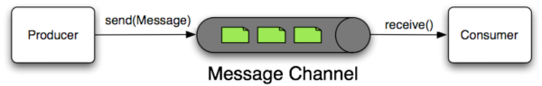
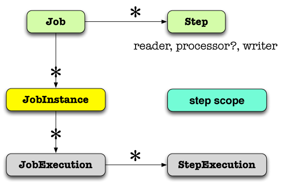

# Have You Seen Spring Lately?

Today, developers are being asked to handle more challenges then ever, and to do so more quickly. It can be a dizzying task to keep up with today's technologies, but Spring has your back. 

In this article we'll look at the latest and greatest Spring projects and their place in the _Spring IO_ platform.


While you can pick up any library and use it _a la carte_, we hope that developers will enter the platform through one of the three channels at the _IO Execution_ tier: 

* [**Spring XD**](http://spring.io/projects/spring-xd) for big-data, batch and integration work 
* [**Spring Boot**](http://projects.spring.io/spring-boot/) for convention-over-configuration-centric and singularity-of-focus-centric Spring application development.
* [**Grails**](http://grails.org/) for rapid web application development with the Groovy language.

From there, a developer may expect to use 	any of the Spring modules in the _IO Foundation_ box supporting integration, batch processing, big data, and web applications, all of which work with our data-access and processing APIs and enjoy the support of cross-cutting technologies like the core dependency injection container, the reactive [_Reactor_](http://github.com/reactor) framework, and  the [Spring Security](http://spring.io/projects/spring-security) project.


## A New Beginning for Spring and For You

### Spring Has a New Home!
Spring's new home on the web is [http://spring.io](http://spring.io). Spring.io is your one-stop shop for [documentation](https://spring.io/docs), the [forums](http://forum.spring.io/), the [blog](https://spring.io/blog), detailed [project information](https://spring.io/projects), and new [getting-started guides](http://spring.io/guides) and tutorials.

### "How Do I Get Started, Quickly?"
We've worked hard on the [Spring team](http://spring.io/team) to answer the question: "how do I get started, quickly?" We've developed a two-pronged solution: better guidance / education and productive-by-default tools.

#### (More) Guidance from the Source
Spring's always had a good documentation story. Spring's always given away the source code and documentation, even when everyone else was selling it. Spring itself was initially the _example code_ given in the pages of a *book* that prescribed a better way forward for enterprise Java. That way forward has taken us further and further from those initial few steps as Spring has raced to meet the ever-moving horizons of technology. It can be easy to forget what those first few steps looked like. We have revisited our "getting started" experience and created the task-focused [getting-started guides](http://spring.io/guides) that explain how to achieve a task in a short text that you should be able to work through in a lunchtime (or less!). Each guide starts with a finished, working code base against which you may check your work, and a _blank_, starter codebase to levelset and start fresh. Suppose you've heard about [REST](http://en.wikipedia.org/wiki/Representational-state-transfer) and want to incorporate it in your application; just check out the [_Building a RESTful Web Service_](https://spring.io/guides/gs/rest-service/) guide, written by experts on the Spring team. If you like, you can skip to the punchline, and you'll get working code you can use. For a richer narrative, just follow along with the guide!

#### Bootstrap Your Productivity with Spring Boot!
Whenever possible, these guides are written using [Spring Boot](http://spring.io/projects/spring-boot). Spring Boot makes it easy to create stand-alone, production-grade Spring-based applications that can you can "just run." Spring Boot takes an opinionated, convention-over-configuration view of the Spring platform and third-party libraries so you can get started with minimum fuss. It focuses attention on your application and away from the conceptual overhead.

Want to try it? [Install the `spring` command line tool](http://projects.spring.io/spring-boot/docs/README.html) (you can use [GVM](http://gvmtool.net/), or [Homebrew on OSX](http://brew.sh/), or simply build the code), and then put the following into a file named `service.groovy`:

```
@Grab("spring-boot-starter-actuator")
@RestController
class Example {

    @RequestMapping("/")
    String home() {
        [message: 'Hello World']
    }
}

```

This is a Groovy-language Spring MVC REST controller that simply returns an object with a property, `message`. On the command line, run `spring run service.groovy` and it will start up and give you a working REST endpoint which you can hit from any browser at [`http://127.0.0.1:8080/`](http://127.0.0.1:8080). The `@Grab` annotation tells Groovy to pull down a Java dependency (as you might do with Maven or Gradle, for example) that the Spring Boot project provides complete with all the libraries you're likely to need for a given task.


#### Bootstrapping Your Development with our open-source and Eclipse-Based Spring Tool Suite and Groovy Tool Suite
If you're a Java developer working in Eclipse then check out our open-source [Spring Tool Suite](http://spring.io/tools/sts) and [Groovy/Grails Tool Suite](http://spring.io/tools/ggts) distributions. They layer on top of an existing instance of the latest-and-greatest Eclipse distribution or you can download them as separate IDEs. I think this last approach is the far more productive path, and, if you want anything else, just add it!

<iframe width="420" height="315" src="http://www.youtube.com/embed/LSNiI9zSn6M" frameborder="0" allowfullscreen></iframe>

## A Richer Web with Spring
### Build Web Applications and Web Services with Spring
Today's applications are as often as not REST-powered backends with rich, JavaScript and HTML5 or native mobile front ends. [REST](http://wikipedia.org/wiki/Representational_state_transfer), of course, is not a standard but a set of principles designed to promote the use and consumption of services that build on, as opposed to merely transit through, HTTP as a platform.

#### REST
Spring MVC (part of the Spring core framework) makes it dead simple to build RESTful web services, and there's an even more concise syntax for building REST services in Spring framework 4's new `@RestController` annotation:

```
package demo;

import org.springframework.web.bind.annotation.RequestMapping;
import org.springframework.web.bind.annotation.RequestParam;
import org.springframework.web.bind.annotation.RestController;

@RestController
public class GreetingController {

	public static class Greeting { 
		private String message; 

		public Greeting(String msg){
		  this.message = msg;
		}
		public String getMessage(){
		  return this.message;
		}
	}
	
	@RequestMapping("/hi")
	public Greeting sayHi(@RequestParam String name){
		return new Greeting( "Hi, " + name +"!" );
	}
}

```

Here's an example of a REST web service that exposes information about `user` and `customer` entities under the `/users` and `/customers` endpoints. In the video we'll use basic HTTP `GET` access from the browser and through an HTTP client that can be installed as a browser plugin to read and delete records.

Note that the output is [in JSON encoding](http://www.wikipedia.com/wiki/json).

<iframe width="560" height="315" src="http://www.youtube.com/embed/OJa_alLc_Iw" frameborder="0" allowfullscreen></iframe>

#### Smarter Clients with Hypermedia and Spring HATEOAS
In the example above, our REST services worked, but suffered from a few weaknesses. First, clients would need to know the deep-links a-priori to be able to access any other resources related to a given entity. In addition, there's no accounting for state! Some resources are stateful. For example, it shouldn't be possible to add something to a shopping cart after the user's already checked out, but there's nothing stopping a client from trying, anyway.

[Hypermedia](http://wikipedia.org/wiki/hypermedia), as espoused in the [HATEOAS](http://wikipedia.org/wiki/hateoas) design pattern can help us here. Ultimately, HATEOAS is just about encoding metadata, or _hypermedia_, along with the response.

If you use Spring HATEOAS, you simply return a Spring HATEOAS `Resource<T>` instance from your Spring MVC controller methods. Here is an example interaction with a HATEOAS-flavored rewrite of the first example:

```
 	@RequestMapping(method = RequestMethod.DELETE, value = "/users/{user}")
    @ResponseBody Resource<User> deleteUser( @PathVariable Long userId ) {
        User user = crmService.removeUser(userId);
		Collection<Link> links = new ArrayList<Link>();

        links.add(linkTo(methodOn(UserController.class)
        	.loadUser(userId)).withSelfRel());

		links.add(linkTo(methodOn(UserController.class)
		    .loadUserCustomers(userId)).withRel( "customers" ));

		links.add(linkTo(methodOn(UserProfilePhotoController.class)
			.loadUserProfilePhoto(userId)).withRel( "photo" ));

        Resource<User> userResource = new Resource<User>(user, links);
        return new ResponseEntity<Resource<User>>(userResource, HttpStatus.OK);
    }

```

In the example above, I return a Spring HATEOAS `Resource` object which contains a collection of `Link` objects and a payload of type `User`. `User` is the
entity being returned to the client. The result looks something like this:

```
{
	"firstName": "Josh",
	"lastName": "Long",
	"username": "joshlong",
	...
	"links" : [
		{ "rel": "self", "href" :"http://localhost:8080/users/5" },
		{ "rel": "photo", "href" :"http://localhost:8080/users/5/photo" },
		{ "rel": "customers", "href" :"http://localhost:8080/users/5/customers" }
	]
}

```

This extra metadata links to resources that have _relevant_ relationships with this resource. Clients follow `rel`s, not URIs, and can tailor their behavior based on the presence of absence of `link`s. A `link` to checkout, for example, would be inappropriate when there's nothing in the shopping cart.

<iframe width="560" height="315" src="http://www.youtube.com/embed/WTJvPP_h8wY" frameborder="0" allowfullscreen></iframe>

Here are some resources to get started with Spring and REST:

* There is a great _Getting Started_ treatment of the subject of [REST service creation with Spring](http://spring.io/guides/rest-service).
* I gave a talk for a webinar called [_Building REST-ful Services with Spring_](http://www.youtube.com/watch?v=SC0FPuDKei0) which you can watch free online on our [@springsourcedev YouTube channel](http://youtube.com/SpringSourceDev). The talk introduces Spring MVC's REST support, Spring HATEOAS, Spring Data REST, Spring Security OAuth, Spring Social and Spring Android. You'll find links to the accompanying code and slides at the YouTube page. Additionally, you'll find a fairly deep tutorial walking [through the concepts in the code](https://github.com/joshlong/the-spring-rest-stack/blob/master/tutorial.asc).
* Ben Hale did a great webinar that speaks to pragmatic questions on [REST style and implementation with Spring](http://www.youtube.com/watch?v=SC0FPuDKei0).
* There's a great _Getting Started_ [guide for Spring HATEOAS](http://spring.io/guides/gs/rest-hateoas/).


#### WebSockets
REST is a great approach to building HTTP-bound web services, but HTTP is essentially a one-sided conversation where the client may only initiate conversations. For an application to be more interactive, it needs to needs to support bi-directional, asynchronous communication between the client and server. [Websockets](http://wikipedia.org/wiki/websockets) is a standardized protocol designed to support these requirements, essentially exposing a bidirectional socket from the server to the client. A secure version of the WebSocket protocol is implemented in Firefox 6, Safari 6, Google Chrome 14, Opera 12.10 and Internet Explorer 10.

Spring supports the [related JSR 356](http://jcp.org/en/jsr/detail?id=356), but offers far more than just that, filling in the gaps where the JSR (understandably) was vague. Spring's WebSocket support can work independent of the JSR, and offers support for STOMP-framed messaging over WebSockets. In addition, Spring also supports the Sock.JS protocol, a superset of the WebSocket protocol that the popular Sock.js client can use to work around firewall restrictions and offer graceful degradation of experience on older browsers.

Here is an example of a WebSocket-ready Spring MVC controller. The `getPositions` method handles all calls from the client to _subscribe_ to events on the `/positions` destination. This is a passive channel that sends back positions at the time of the call. The `executeTrade` method handles calls from the client into the Spring MVC websocket controller. Both methods are accompanied by an argument for the `javax.security.Principal` which Spring Security is placing in the request for us, automatically.


```

@Controller
public class PortfolioController {

		private static final Log logger = LogFactory.getLog(PortfolioController.class);
		private final PortfolioService portfolioService;
		private final TradeService tradeService;

 		@Inject
        public PortfolioController(PortfolioService portfolioService, TradeService tradeService) {
                this.portfolioService = portfolioService;
                this.tradeService = tradeService;
        }

        @SubscribeEvent("/positions")
        public List<PortfolioPosition> getPositions(Principal principal) throws Exception {
                logger.debug("Positions for " + principal.getName());
                Portfolio portfolio = this.portfolioService.findPortfolio(principal.getName());
                return portfolio.getPositions();
        }

        @MessageMapping("/trade")
        public void executeTrade(Trade trade, Principal principal) {
                trade.setUsername(principal.getName());
                logger.debug("Trade: " + trade);
                this.tradeService.executeTrade(trade);
        }

        @MessageExceptionHandler
        @SendToUser("/queue/errors")
        public String handleException(Throwable exception) {
                return exception.getMessage();
        }

}
```

To see WebSockets in action, check out the following video.

<iframe width="560" height="315" src="http://www.youtube.com/embed/9vLiV5g-r6c" frameborder="0" allowfullscreen></iframe>

* Rossen Stoyanchev has an amazing [websocket example application here](https://github.com/rstoyanchev/spring-websocket-portfolio). The video above demonstrates this code.
* Rossen also put together a fantastic webinar introducing [websocket support and using that very same sample application as a demo](http://spring.io/blog/2013/10/23/webinar-replay-building-websocket-browser-applications-with-spring).

### Secure, Connected Web Applications and Web Services with Spring

#### Spring Security
Spring Security integrates well with enterprise authentication and authorization backends like [SAML](http://projects.spring.io/spring-security-saml), [Kerberos](http://projects.spring.io/spring-security-kerberos), `pam`, and LDAP. Spring Security provides best-of-breed open web-ready, and enterprise-ready, security for modern applications. Spring Security supports - for example -  acting as both an [OAuth client and service](http://spring.io/projects/spring-security-oauth) and provides [comprehensive CSRF (Cross Site Request Forgery]) protection](http://spring.io/blog/2013/08/21/spring-security-3-2-0-rc1-highlights-csrf-protection).

_Get Started_

* The getting started [guide on securing web applications with Spring](http://spring.io/guides/gs/securing-web/) is an easy, quick way to get going
quickly with Spring Security in a web application.
* the webinar and code from my webinar [_Building REST-ful Services with Spring_](http://www.youtube.com/watch?v=SC0FPuDKei0)  uses Spring Security to secure the non-OAuth parts of the REST API and Spring Security OAuth to secure OAuth communication between the client and the browser.

#### Spring Social

Today's web is busy, connected. Today's users have lives all of their own online, and the best applications usually
find a way to integrate with that online persona. This is easy to do because, thanks to REST, there are many rich third party
 APIs with which to integrate today - SOA has finally arrived! - and by and large they're all secured with either OAuth 1.0, OAuth 1.0.a or OAuth 2.0.
 Spring Social provides the core OAuth authentication and authorization support as an OAuth client, and makes it dead simple to layer on top type-safe
 Java API bindings. There are many bindings provided out of the box, and via a [rich ecosystem of third party bindings](https://github.com/Spring-Projects/spring-social/wiki/api-providers) built on top of Spring Social.


Once Spring Social Facebook has established a valid Facebook API connection, we can use the `Facebook` API in our Spring MVC code with no problems!

```
@Controller
@RequestMapping("/")
public class HelloController {

    @Inject private Facebook facebook;

    @RequestMapping(method=RequestMethod.GET)
    public String helloFacebook(Model model) {
        model.addAttribute(facebook.userOperations().getUserProfile());
        return "hello";
    }

}
```


 Here's an example working through the [Spring Social Showcase](https://github.com/spring-projects/spring-social-samples/tree/master/spring-social-showcase), which features lots of cool integrations and examples. Other third party bindings
 often add their own screens when they fork this particular project to showcase their binding's unique features.


 <iframe width="560" height="315" src="http://www.youtube.com/embed/XAq6JQqCGBM" frameborder="0" allowfullscreen></iframe>

 There are a lot of great ways to get started with Spring Social.

 * I'd check out the getting started guide on registering a [Facebook developer application](http://spring.io/guides/gs/register-facebook-app/) and [accessing Facebook Facebook data](http://spring.io/guides/gs/accessing-facebook/).
 * The Spring Social Showcase is a great, [easy to use example of Spring Social](https://github.com/spring-projects/spring-social-samples/tree/master/spring-social-showcase).

### The Mobile Web
Today's users are accessing the web primarily through their mobile devices. Mobile applications extend the reach of your business significantly.

 for 2Q 2012 and 2013")

There are many people using mobile ecosystem applications and Spring can get you there, quicker. [Spring for Android](http://projects.spring.io/spring-android/) provides the powerful `RestTemplate` object and makes it so that any REST service you'd like to talkto  is as easy as in the core Spring framework. Spring for Android can even be made to work with Spring Social-provided bindings!

Spring Mobile makes it easy to serve mobile-form factor friendly HTML applications and handle moble visitors in a more device-appropriate way. This can be a useful approach when developing fallback experiences for platforms you don't intend to prioritize. Many companies adopt such a strategy for applications not destined for Android or iOS.

Here's an example of working with two applications, one an iOS Objective-C client and the other a Spring for Android client. They both speak OAuth to communicate with the Spring Security OAuth-secured REST service I introduced earlier.

<iframe width="560" height="315" src="http://www.youtube.com/embed/fgNL_g3K7FI" frameborder="0" allowfullscreen></iframe>

## Dealing with Data
Spring provides a rich set of technologies to work with data and data-services.

### Traditional RDMBSes
The core Spring framework has great support for JDBC, and JDBC-based ORM access, including a transaction API that insulates you from the various incompatible nuances typical of transactional resources like SQL databases and message queues.

### NoSQL, NewSQL, and NOSQL with Spring Data

The Spring Data projects embrace the new breed of so-called NoSQL, NewSQL, or NOSQL solutions. Spring Data is not one API to rule them all, instead it is an umbrella project with specific APIs for popular "database" technologies like [Redis](http://projects.spring.io/spring-data-redis/), [MongoDB](http://projects.spring.io/spring-data-mongodb/), and [Neo4J](http://projects.spring.io/spring-data-neo4j/). There are many third party bindings, and  some support technologies like ElasticSearch and SOLR, CouchDB, and Riak.

One concept common to many Spring Data modules, including the [Spring Data JPA](http://spring.io/projects/spring-data-jpa) module, is the notion of a Spring Data repository. A Spring Data repository is an interface that Spring Data implements at runtime using convention-over-configuration to satisfy the interface contract dynamically, typically by interacting with some backend resource. Here's a Spring Data JPA repository that I can inject anywhere in my code and use. I've commented what sort of query each method generates, basically.

```
@RestResource (path = "users", rel = "users")  // automatically exposes a REST endpoint at /users/*
public interface UserRepository extends PagingAndSortingRepository<User, Long> {

	// select * from users where username = ?
	User findByUsername(@Param("username") String username);

	// select * from users where firstName =? or lastName = ? or username = ?
	List<User> findUsersByFirstNameOrLastNameOrUsername(
  	  @Param("firstName") String firstName,
  	  @Param("lastName") String lastName,
  	  @Param("username") String username);

}
````

In this case I've turned on Spring Data JPA's repository support, but I could've just as easily turned on Spring Data MongoDB's, Spring Data Neo4j's or Spring Data GemFire's and those query methods would've instead mapped to those backend databases, instead of SQL.


### Surviving the Hadoop Wild, Wild West with Spring for Apache Hadoop
Today's Hadoop ecosystem represents a fantastic new opportunity with some very familiar problems. Think back to 2003 - Spring was new on the scene - and being the guy that could get Hibernate, Quartz and Struts working in the same web application ten years ago was a surefire way to become an office rock-star! These projects were developed in isolation by individual open-source projects absent each other's use-cases and standards: they did not share common runtime concepts and did not share common API concepts like transaction management. In today's world, using Hibernate and Struts and Quartz in the same application is a snap thanks to Spring. In the Hadoop ecosystem today, we find ourselves with the same sort of integration challenges and here again Spring is offering a solution. [Spring for Apache Hadoop](http://spring.io/projects/spring-hadoop) makes working with Hadoop-ecosystem technologies like HBase, Hive, Pig, Cascading, and YARN from within standard Spring as easy as possible. In addition, Spring for Apache Hadoop can rely on platform niceties like property-placeholder resolution to ease configuration.

Spring for Apache Hadoop is known to work with the following Hadoop distributions:

* Apache Hadoop 1.2.1 stable
* Apache Hadoop 2.0.6-alpha
* Apache Hadoop 2.1.0-beta
* Cloudera CDH4
* Hortonworks HDP 1.3
* **[Pivotal HD 1.0](http://www.gopivotal.com/pivotal-products/data/pivotal-hd)** - this is the [@GoPivotal](http://twitter.com/gopivotal) Hadoop distribution. It includes the world's first true SQL processing for enterprise-ready Hadoop, builds on top of Hadoop 2, is supported by EMC's global, 24x7 support infrastructure, and is available as a seperate, easy-to-use [single-node virtual machine for development](http://www.gopivotal.com/pivotal-products/data/pivot* al-hd#4).


To learn more about Spring for Apache Hadoop, check out these resources:

* the [Spring for Apache Hadoop samples](https://github.com/spring-projects/spring-hadoop-samples) demonstrate common concepts like how to use Cascading, YARN, and basic Map-Reduce with Spring for Hadoop.

## Online and Batch Processing of Data
Spring clearly knows how to talk to the data sources you're probably most interested in talking to. The next question, of course, is how to process data from those datastores. Spring supports all manner of approaches.

### Spring Integration to Build Messaging-Driven Architectures
[Spring Integration](http://spring.io/projects/spring-integration) is an integration framework in the style of the patterns in Gregor Hohpe and Bobby Woolf's epic tome, _Enterprise Integration Patterns_. In the world of Enterprise Integration, systems are connected through channels (message queueus). Messages flow from one component to another, transforming, enriching, splitting, aggregating and routing messages as they fly through the event bus. Spring Integration offers a set of adapters - components that can adapt messages from external systems into standard Spring Integration messages and thus connect Spring Integration applications with the different systems like FTPS, SFTP, Twitter, Splunk, JDBC, JMS, AMQP, Twitter, and GemFire continuous-queries.




### Batch Processing with Spring Batch to Avoid Idle Computational Resources
Spring Integration is all about reacting to events in realtime, about being able to integrate with data and services from disparate systems. Spring Batch is all about the safe processing of large amounts of sequential data like large datasets in, for example, a flat file, a JDBC database, or a large XML document. Its design is also largely intact in the [Batch JSR](http://jcp.org/en/jsr/detail?id=352), where we contributed a lot of leadership to make it the best possible standard for the community. As a specification, JSR 352 is necessarily vague on some poionts. In particular, it does not prescribe any item readers and writers out of the box. Users going to the JSR via the Spring Batch implementation will appreciate the rich set of readers and writers unique to Spring Batch.

Spring Batch `job`s contain a sequence of one or more `step`s. Each `step` may optionally read (through its provided `ItemReader`), optionally process (through a provided `ItemProcessor`), and  optionally write (through a provided `ItemWriter`).



Here's an example of using Spring Integration to respond to new file system events ("there's a new file in a monitored folder") and then, as a result, process the file using Spring Batch. The code is available in the resources below.

<iframe width="560" height="315" src="http://www.youtube.com/embed/wo2gs_1QTXs" frameborder="0" allowfullscreen></iframe>


For more resources on using Spring Batch and Spring Integration:

* check out the  [_gettting started_ guide showing how to do batch processing with Spring Batch](http://spring.io/guides/gs/batch-processing/).
* check out the  [_getting started_ guide showing how to data integration with Spring Integration](http://spring.io/guides/gs/integration/)
* the code for the demo above is available on my GitHub account as part of a larger codebase, [_A Walking Tour of All of Springdom_](https://github.com/joshlong/a-walking-tour-of-all-of-springdom).

### Surfing the Tidal Data Deluge with Spring XD

<iframe width="560" height="315" src="http://www.youtube.com/embed/BgehjMBi8oQ" frameborder="0" allowfullscreen></iframe>

## Spring is Where You Want To Be
### on Java EE 7
### on Tomcat
### In the Cloud
